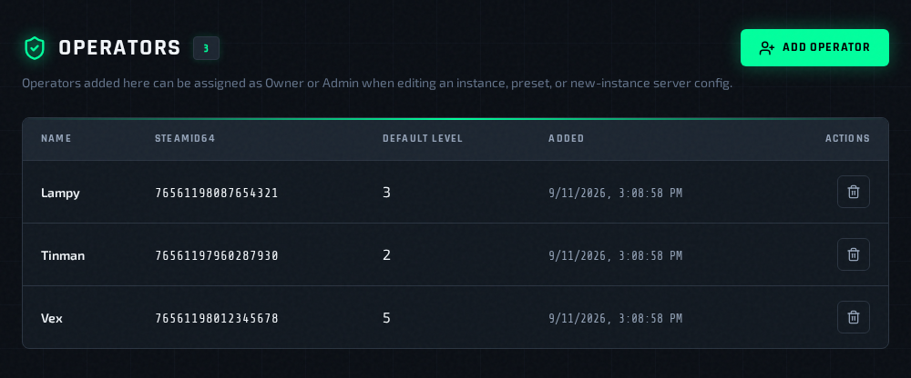
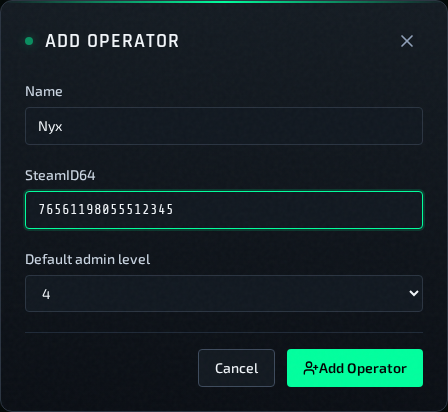
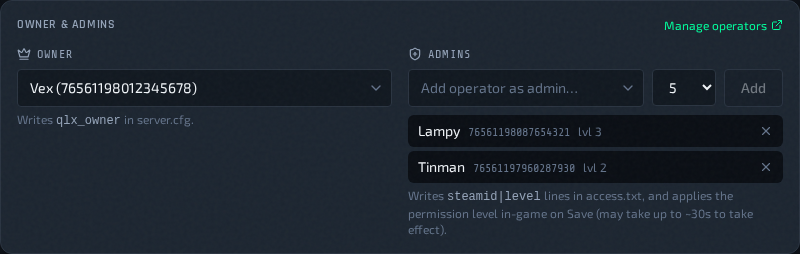

# Operators

QLSM keeps a directory of named operators — the people who run or moderate
your servers, each with their SteamID64. Add someone once, then assign them as
a server's **Owner** or **Admin** by picking their name, instead of looking up
and retyping their SteamID in `server.cfg` and `access.txt`.

Operators are managed in **Settings → Operators** and assigned from the
**Owner & Admins** panel wherever server configs are edited.

## Add An Operator

1. Go to **Settings → Operators**.
2. Click **Add Operator**.
3. Enter a display name and the operator's SteamID64 (17 digits, starting
   with `7656119`).
4. Choose a **Default admin level** (0-5). This is the level filled in when
   you insert the operator from the `access.txt` editor's autocomplete.
5. Click **Add Operator**.

Each SteamID64 can only be in the directory once.

## Delete An Operator

1. Go to **Settings → Operators**.
2. Click the delete icon on the operator's row and confirm.

Deleting an operator only removes them from the directory. It does **not**
remove them from any server: an existing `qlx_owner` or `access.txt` entry
with their SteamID64 stays in place, and so does their in-game permission.
To take someone's access away, remove them in the Owner & Admins panel (or
from `access.txt`) and save.

## Assign Owner Or Admin

The **Owner & Admins** panel sits above the file list on the
**Configuration Files** tab. It appears in the instance **Edit Config**
window, the **Add Instance** form, and the preset add and edit pages.

- **Owner** — pick an operator. This writes their SteamID64 to the
  `qlx_owner` line of `server.cfg`. The owner always has level 5. The change takes effect when the server restarts, so leave
  **Restart after saving** on.
- **Admins** — pick an operator, choose a level (the picker starts at 5), and
  click **Add**. This adds a `steamid|level` line to `access.txt`. Click
  **×** on an entry to remove it.

Higher levels unlock more minqlx admin commands. Level **5** is the highest
and includes `!setperm`, which lets that admin grant permissions to other
players, so only give 5 to people you trust with that.

The **Manage operators** link opens **Settings → Operators** in a new tab.

## What Happens In-Game

When you click **Save Configuration** on an instance, QLSM also pushes the
admin levels from `access.txt` into the running server's minqlx permissions.
They can take up to about 30 seconds to apply.

- **Adding** an admin gives them that level in-game.
- **Removing** an admin sets their in-game level back to 0.
- **Players promoted in-game** with `!setperm`, and never added through
  QLSM, are left alone.

**New instances:** admins set in the **Add Instance** form are written to
`access.txt`, but they don't get their in-game level until the instance's
config is saved once. After the deploy finishes, open **Edit Config** and
click **Save Configuration**.

Presets only store the files. Nothing is applied in-game until an instance
using them is saved.

### If The Push Fails

If QLSM can't reach the server (for example, SSH or Redis is down), the
config is still saved, but the instance log shows:

> Warning: access.txt admin permissions could not be synced to the running
> instance (SSH/Redis unreachable).

In-game permissions stay as they were until the next successful save.
Removing an admin while the push fails means **they keep their old level
in-game**. Check the instance log after removing someone, and save again once
the server is reachable.

### Lines That Are Ignored

Only lines with a SteamID64 and a level from 0 to 5 are pushed in-game. These
lines are skipped:

- A level out of range or not a number, like `|99` or `|e`.
- A line with no level.
- Quake Live's own roles: `|admin`, `|mod` and `|ban`. These still work for
  Quake Live itself, but they don't grant minqlx permissions.

The `access.txt` editor underlines levels like `|99` and `|e`. It doesn't
flag the Quake Live roles, because Quake Live accepts them, or a missing
level. A skipped line doesn't stop the save, and any level the player had
from an earlier QLSM save is reset to 0.

## Add From The access.txt Editor

While typing a SteamID in `access.txt`, the editor suggests operators from the
directory. You can search by SteamID or by name. Picking one inserts
`steamid|level` using the operator's default admin level.

## Related Pages

- [Edit Configs, Plugins, Factories, And Hooks](../operations/edit-configs.md)
- [User Management & API Keys](user-management.md)
