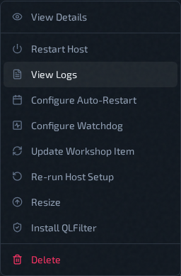
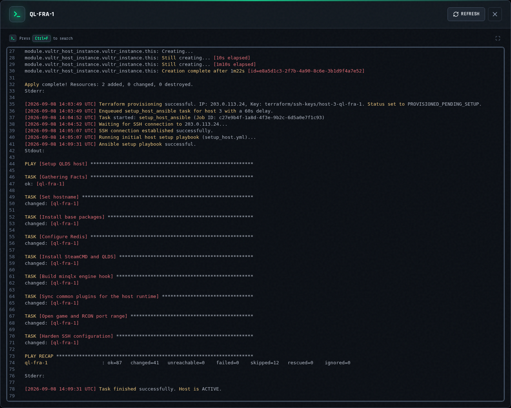
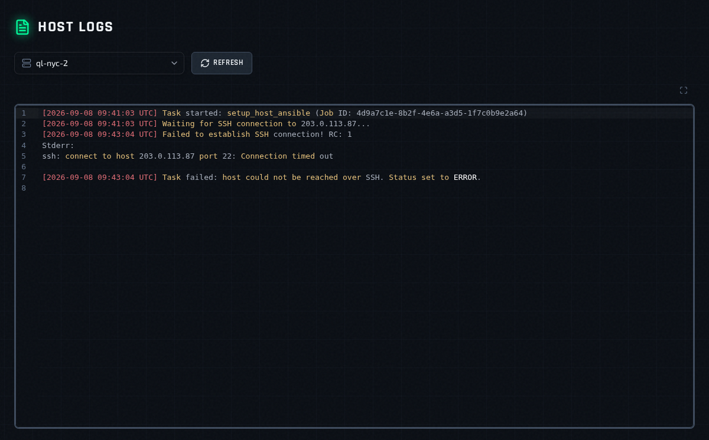

# Host Logs

Host logs record the work QLSM does to build and maintain a host's infrastructure. When a host lands in **Error**, this is where the reason is.

A host's log includes:

- **Provisioning** a cloud host, with the Terraform output
- **Host setup**, both the first run and every **Re-run Host Setup**, with the Ansible output
- **Resizing** the host
- **Deleting** or removing the host
- **Automatic recovery**, when a host in **Error** becomes reachable again
- Any of these tasks **timing out or crashing**

Routine actions such as restarts, workshop updates, and QLFilter changes are not recorded here.

## Host Logs vs Server Logs

| | Host Logs | [Server Logs](server-logs.md) |
| --- | --- | --- |
| Covers | One host | One instance |
| Records | QLSM building and maintaining the host | What the game server printed |
| Stored | In QLSM | On the host, read over SSH |
| Works when the host is down | Yes | No |

Because host logs are kept by QLSM rather than fetched from the machine, you can still read them when the host is unreachable — which is usually exactly when you need them.

## Open From A Host

Open the host row **Actions** menu on the Servers page and choose **View Logs**.

The logs open in a popup for that host, scrolled to the newest entry at the bottom.

## Browse Logs Across Hosts

Open **Settings** → **Host Logs** from the top menu. This page adds a host picker, so you can move between hosts without going back to the Servers page.

## Reading The Log

Every line starts with a timestamp, and each background task opens with a `Task started:` line naming the task. When a task runs Terraform or Ansible, its full output is included under that line — `PLAY RECAP` at the end of an Ansible run shows how many steps changed or failed.

The log keeps growing over the life of the host: each provision, setup run, or restart adds to the end. Scroll up for older activity.

- Use `Ctrl+F` inside the viewer to search.
- **Refresh** loads anything added since you opened it.
- The expand button in the top-right corner of the viewer opens the log full screen.

## Diagnosing A Failed Host

1. Open **View Logs** on the host in **Error**.
2. Scroll to the bottom and find the most recent `Task started:` line — the failure is below it.
3. Look for a line beginning `Failed`, `Error`, or `Task failed`, and the `Stderr:` output under it.

Some common ones:

- **`Failed to establish SSH connection`** — QLSM could not reach the machine. Check that it is running, that its IP address is correct, and that its SSH port is open to QLSM.
- **`Ansible setup playbook failed`** — setup reached the host but a step failed. The Ansible output below names the step. After fixing the cause, use **Re-run Host Setup** from the [Host Actions Menu](host-actions-menu.md).
- **`Terraform executable not found`** or a failed Terraform command — the cloud provisioning step itself failed. The Terraform output below it gives the reason.

When reporting a problem, copy the specific error lines rather than the whole log.

## Related Pages

- [Host Actions Menu](host-actions-menu.md)
- [Server Logs](server-logs.md)
- [Use Logs And Chat Logs](logs-and-chat.md)
- [Deployment Troubleshooting](../help/deployment-troubleshooting.md)
