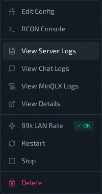

# Server Logs

Use **View Server Logs** from the instance action menu to fetch remote service logs. Server logs are exported from the systemd journal into a rotating file on the host, so older activity stays available as archives instead of aging out of the journal.

## File Selection

The source picker next to **Refresh** shows a **LIVE** or **ARCHIVED** badge for the selected file:

- **Current** — the live, still-growing log
- **Archives** — grouped by month, newest first (for example "Jul 29", with "Jul 29 (2)" if the log rotated more than once that day)

Selecting a different file reloads it immediately using the active filter.

## Filters in UI

### Filter modes

- **Last N Lines**
- **Time Range** — only available for the current (live) log; archived files hide this option, since a rotated file has no journald time range to query
- **All**

For **Current**, Last N Lines and Time Range query the live systemd journal, while All reads the complete current rotating file. For an archive, Last N Lines and All read the selected archive file.

### Line presets

`100`, `250`, `500`, `1000`, `2500`

### Time presets

`15 min`, `30 min`, `1 hour`, `3 hours`, `12 hours`, `24 hours`

## Viewer Behavior

- Logs are displayed in a read-only CodeMirror panel.
- After load, scroll auto-jumps to bottom.
- Use `Ctrl+F` inside editor for search.
- **`Refresh`** and **`Apply`** trigger a new fetch.

## Related Pages

- [Chat Logs](chat-logs.md)
- [MinQLX Logs](minqlx-logs.md)
- [Use Logs And Chat Logs](logs-and-chat.md)
- [Instance Actions Menu](instance-actions-menu.md)
