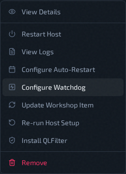

# Configure Watchdog

Open from **Servers** -> host row **Actions** -> **Configure Watchdog**.

The watchdog restarts a server instance whose game has frozen. It is off by default and is set per host: one watchdog covers every instance on that host, including instances added later.

## Why It Is Needed

A Quake Live server can occasionally freeze without crashing. The process stays up, so nothing restarts it, but the game stops running — players time out and the server sits dead until someone restarts it by hand.

With the watchdog on, QLSM spots the freeze and restarts only the affected instance. Other instances on the host keep running.

## How It Decides An Instance Is Frozen

Every check, the watchdog looks at two things for each running instance:

- **Incoming game traffic is piling up** instead of being read by the server.
- **The server has stopped using CPU** since the previous check.

Both must be true for several checks in a row before it restarts the instance. Traffic alone is not enough — a busy server can briefly fall behind during a slow map load or a burst of traffic, and it keeps using CPU while it does. A frozen server does not.

Newly started instances are left alone for a short grace period while they boot and load the map.

## Turning It On

1. Open **Configure Watchdog** on the host. The host must be **Active**.
2. Switch **Enabled** on.
3. Keep the default settings unless you have a reason to change them.
4. Click **Save**.

The host shows **Configuring** while QLSM sets the watchdog up, then returns to **Active**. Once it is on, the menu item shows an **ON** badge.

To turn it off, open the same modal, switch **Enabled** off, and save. QLSM stops the watchdog and removes it from the host.

## Settings

| Setting | Default | What it does |
| --- | --- | --- |
| Check Interval (s) | 10 | How often each instance is checked. |
| Recv-Q Threshold (bytes) | 8192 | How much unread game traffic counts as "piling up". A healthy server stays well below this. |
| Strikes Before Restart | 3 | How many checks in a row must look frozen before a restart. With the defaults, a frozen instance is restarted after about 30 seconds. |
| Boot Grace Period (s) | 90 | How long a newly started instance is ignored. |
| Max Restarts / Window | 3 | The most restarts allowed for one instance within the window below. |
| Rate Limit Window (s) | 900 | The window for the limit above. Once an instance hits the limit, the watchdog stops restarting it and only records the freeze, so a server that keeps freezing can't restart forever. |
| Capture forensics | On | Saves a snapshot of what the frozen server was doing just before restarting it. Useful when reporting the problem. |
| Dry-run | Off | Detects and records freezes but never restarts anything. Use it to see what the watchdog would do on a host before letting it act. |

## Where Restarts Are Recorded

The watchdog keeps its own record on the host, not in QLSM:

- **Events log:** `/var/lib/qlsm/watchdog/events.jsonl` — one line per freeze, restart, or skipped restart.
- **Forensics:** `/var/lib/qlsm/watchdog/forensics/` — one file per captured freeze.
- **Service log:** `sudo journalctl -u ql-watchdog`

The [Host Logs](host-logs.md) only record whether turning the watchdog on or off succeeded.

## Related Pages

- [Host Actions Menu](host-actions-menu.md)
- [Configure Auto-Restart](auto-restart.md)
- [Host Logs](host-logs.md)
